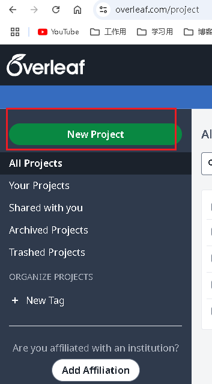
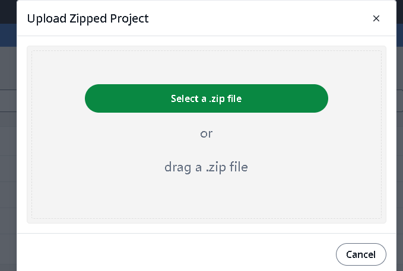
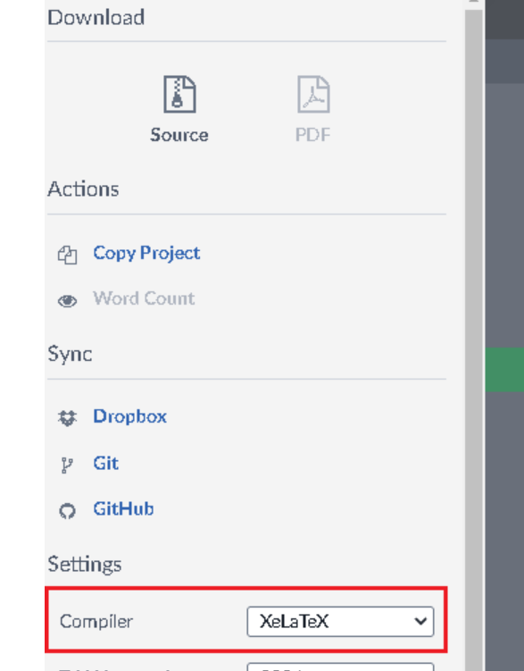
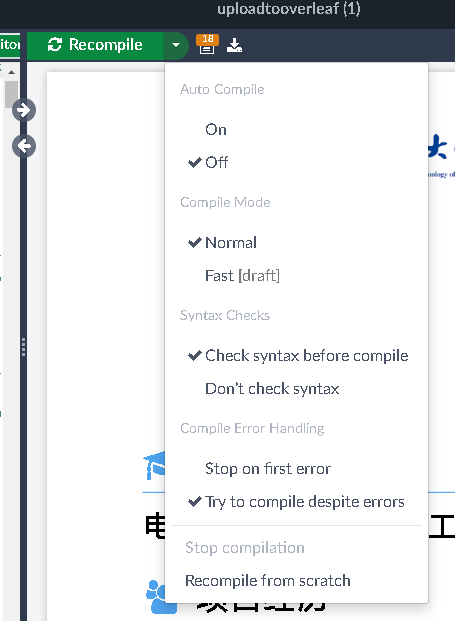
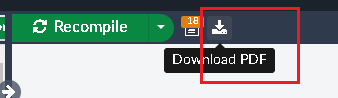

# UESTCResume
电子科技大学大三找实习简历latex模板喵喵喵byzl推荐在overleaf上使用谢谢

这个是我在找工作的时候用latex制作的仿照超级简历的一个简历模板  

使用效果大概是这个样子的说

使用教程

1. 获得这个资源

2. 注册overleaf网站 https://www.overleaf.com/

3. 点击创建新Projext 

   

4. 点击上传Project  把我的这个githubrepo里面的压缩包文件上传进去

   

5. 进入项目  检查项目配置

   1. 编译器应该选择 XeLaTex (点击Menu在左边栏查看Complier设置)

   2. 右边ReCompile选项如图  防止有些时候选成了其他模式 比如Fast啥的 导致图片资源无法加载

      

      3. 选中左边的tex文件编译一下看看  确定自己的项目设置是正确的  
      4. 查看左边的tex文件  改动文本 生成自己的简历文本 （基本上只要小小的改动文本信息就OK了 所以对于不会Latex语法或者只会一点的同学其实是很友好的喵 我感觉）
      5. 我的改动大概就生成一个这个样子的简历喵喵喵

6. 这个按钮导出PDF文件喵

#### 其他

如果你在 使用该模板当中 遇到问题 欢迎向我提起ISSUE讨论喵

如果有其他的好IDEA或者Improvement的话 也给我说喵

如果有大厂内推机会  求求你推推我  孩子找不到工作 很可怜的 

